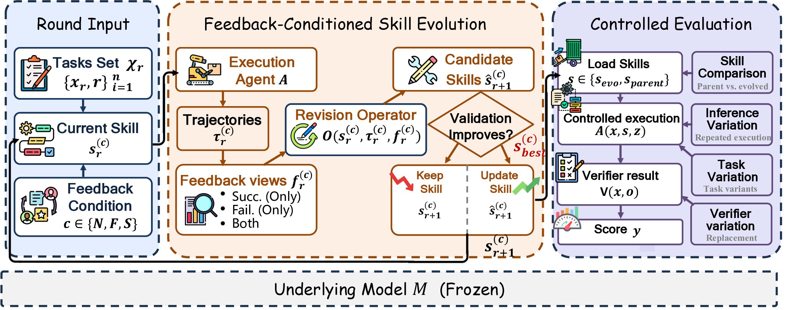

# RethinkSkill

### [Rethinking Self-Evolving Agent Skills: Feedback Dynamics over Multiple Rounds](https://arxiv.org/abs/2608.02636)

A controlled study of how success and failure feedback shape self-evolving
agent skills over multiple rounds.

[Overview](#overview) ·
[Methods](#self-evolution-methods) ·
[Benchmarks](#benchmark-coverage) ·
[Quick start](#quick-start) ·
[Reproducibility](#reproducibility) ·
[Extensions](#external-extensions)

## Overview

  

Self-evolving agents turn execution feedback into a persistent skill that can
be reused on future tasks without updating model weights. RethinkSkill asks a
more controlled question:

> When does another round of skill evolution produce a durable improvement,
> and how does that answer change when the optimizer sees successes, failures,
> or both?

Across 3 models and 5 primary benchmarks, the study evaluates 388 candidates
in 42 matched feedback runs over 14 model–benchmark settings. Validation
identifies 55 byte-distinct best candidates and selects an evolved skill in 11
settings; 9 of those 11 improve released-test performance.

In the primary study, all 11 selected evolved skills come from feedback
conditions that include failed trajectories: nine from Normal and two from
Fail-only. The relative ranking of those views remains model- and
benchmark-dependent, and validation, test, robustness, and transfer do not
always prefer the same skill. The primary models are GPT-5.5, Gemini 3.1 Pro,
and DeepSeek V4-Pro. Test-time scaling is likewise uneven: oracle Parallel
Sampling nearly recovers the evolved SearchQA result but remains far behind on
SpreadsheetBench, while Sequential Refinement recovers neither gain.

## Self-evolution methods

The paper groups representative self-evolving skill systems by the execution
evidence exposed during revision. RethinkSkill turns the same distinction into
three matched feedback arms while holding the remaining evolution procedure
fixed.

<table>
  <thead>
    <tr>
      <th>Feedback view</th>
      <th>Representative systems</th>
      <th>RethinkSkill arm</th>
    </tr>
  </thead>
  <tbody>
    <tr>
      <td><strong>Success only</strong></td>
      <td><a href="https://arxiv.org/abs/2605.18401">SkillsVote</a></td>
      <td><code>success_only</code></td>
    </tr>
    <tr>
      <td><strong>Failure only</strong></td>
      <td>
        <a href="https://arxiv.org/abs/2606.01139">SkillRevise</a> ·
        <a href="https://arxiv.org/abs/2604.08618">SkillForge</a> ·
        <a href="https://arxiv.org/abs/2603.02766">EvoSkill</a> 
        <a href="https://arxiv.org/abs/2602.02474">MemSkill</a> ·
        <a href="https://arxiv.org/abs/2606.01311">SkillAdaptor</a>
      </td>
      <td><code>fail_only</code></td>
    </tr>
    <tr>
      <td><strong>Success + failure</strong></td>
      <td>
        <a href="https://arxiv.org/abs/2605.23904">SkillOpt</a> ·
        <a href="https://arxiv.org/abs/2603.25158">Trace2Skill</a> ·
        <a href="https://arxiv.org/abs/2604.09025">GeoSkill</a> 
        <a href="https://arxiv.org/abs/2605.10999">SkillGen</a> ·
        <a href="https://arxiv.org/abs/2605.29829">OptSkills</a>
      </td>
      <td><code>normal</code></td>
    </tr>
  </tbody>
</table>

The named systems are literature context, not bundled reimplementations. This
repository implements the controlled RethinkSkill evolution procedure and its
three feedback arms.

## Benchmark coverage

The catalog declares 20 benchmark capabilities. Six belong to the paper's
research release: five primary benchmarks plus ALFWorld in the appendix. The
remaining 14 are explicitly external extensions.

<table>
  <thead>
    <tr>
      <th>Benchmark</th>
      <th>Support</th>
    </tr>
  </thead>
  <tbody>
    <tr>
      <td><a href="https://arxiv.org/abs/1704.05179">SearchQA</a></td>
      <td>Built-in native harness</td>
    </tr>
    <tr>
      <td><a href="https://github.com/databricks/officeqa">OfficeQA</a></td>
      <td>Built-in native harness</td>
    </tr>
    <tr>
      <td><a href="https://arxiv.org/abs/2007.00398">DocVQA</a></td>
      <td>Built-in native harness</td>
    </tr>
    <tr>
      <td><a href="https://arxiv.org/abs/2604.01754">LiveMathematicianBench</a></td>
      <td>Built-in native harness</td>
    </tr>
    <tr>
      <td><a href="https://arxiv.org/abs/2406.14991">SpreadsheetBench</a></td>
      <td>First-party optional package</td>
    </tr>
    <tr>
      <td><a href="https://arxiv.org/abs/2010.03768">ALFWorld</a></td>
      <td>First-party optional package; official corpus required</td>
    </tr>
    <tr>
      <td><a href="https://aclanthology.org/Q19-1026/">Natural Questions</a></td>
      <td>Optional offline QA adapter; no live retrieval</td>
    </tr>
    <tr>
      <td><a href="https://aclanthology.org/P17-1147/">TriviaQA</a></td>
      <td>Optional offline QA adapter; no live retrieval</td>
    </tr>
    <tr>
      <td><a href="https://aclanthology.org/2023.acl-long.546/">PopQA</a></td>
      <td>Optional offline QA adapter; no live retrieval</td>
    </tr>
    <tr>
      <td><a href="https://aclanthology.org/D18-1259/">HotpotQA</a></td>
      <td>Optional offline QA adapter; no live retrieval</td>
    </tr>
    <tr>
      <td><a href="https://aclanthology.org/2020.coling-main.580/">2WikiMultiHopQA</a></td>
      <td>Optional offline QA adapter; no live retrieval</td>
    </tr>
    <tr>
      <td><a href="https://aclanthology.org/2022.tacl-1.31/">MuSiQue</a></td>
      <td>Optional offline QA adapter; no live retrieval</td>
    </tr>
    <tr>
      <td><a href="https://arxiv.org/abs/2210.03350">Bamboogle</a></td>
      <td>Optional offline QA adapter; no live retrieval</td>
    </tr>
    <tr>
      <td><a href="https://arxiv.org/abs/2203.06482">FiNER</a></td>
      <td>Optional file-backed prediction adapter</td>
    </tr>
    <tr>
      <td><a href="https://doi.org/10.1021/acs.jcim.6b00564">USPTO-50K</a></td>
      <td>Optional file-backed prediction adapter</td>
    </tr>
    <tr>
      <td><a href="https://huggingface.co/datasets/gretelai/symptom_to_diagnosis">Symptom2Disease</a></td>
      <td>Optional file-backed prediction adapter</td>
    </tr>
    <tr>
      <td><a href="https://aclanthology.org/2024.emnlp-main.452/">LawBench-charge</a></td>
      <td>Optional file-backed prediction adapter</td>
    </tr>
    <tr>
      <td><a href="https://arxiv.org/abs/2501.09004">AEGIS2</a></td>
      <td>Optional file-backed prediction adapter</td>
    </tr>
    <tr>
      <td><a href="https://arxiv.org/abs/2207.01206">WebShop</a></td>
      <td>Optional adapter; official WebShop runtime required</td>
    </tr>
    <tr>
      <td><a href="https://static.scale.com/uploads/674f4cc7a74e35bcaae1c29a/MCP_Atlas.pdf">MCP-Atlas</a></td>
      <td>Declared only; see the <a href="https://github.com/scaleapi/mcp-atlas">official repository</a></td>
    </tr>
  </tbody>
</table>

Linked benchmark names point to the original benchmark paper. Where no
standalone paper is available, the link points to the official dataset or
project release.

See [Benchmark support](docs/BENCHMARKS.md) for datasets, metrics, and runtime
requirements.

## Provider interfaces

Target execution and skill optimization use the same provider contract and can
select different backends.

| Provider | Interface | Credential boundary |
| --- | --- | --- |
| <code>openai-compatible</code> | HTTP API | Explicit environment-variable name |
| <code>codex</code> | Codex CLI | Existing Codex session |
| <code>claude-code</code> | Claude Code CLI | Session or explicit gateway environment |
| <code>gemini-cli</code> | Gemini CLI | Gemini/Google CLI environment |

API keys are never accepted as configuration values. The CLI receives only the
name of the environment variable that holds a credential. Provider launchers
receive a provider-specific environment allowlist rather than the complete
host environment.

## Quick start

### Install

~~~bash
git clone https://github.com/HKUST-KnowComp/rethinkskill.git
cd rethinkskill

python -m venv .venv
source .venv/bin/activate
python -m pip install -e ".[dev,spreadsheet]"
~~~

Install the two first-party runtime packages only when needed:

~~~bash
python -m pip install -e integrations/spreadsheetbench
python -m pip install -e integrations/alfworld
~~~

### Run a zero-model smoke check

This command freezes the included synthetic QA fixture, target skill, rendered
task inputs, and output scope. It does not contact a model:

~~~bash
rethinkskill native-preflight \
  --benchmark searchqa \
  --dataset examples/live_smoke/qa \
  --skill examples/live_smoke/skill.md \
  --out-root runs/readme-smoke \
  --split test \
  --limit 2
~~~

Other zero-model entry points include:

~~~bash
rethinkskill provider-catalog
rethinkskill optimizer-catalog
rethinkskill plan-protocol --benchmark searchqa
rethinkskill validate-run runs/<run>
~~~

### Run an authorized model call

Use an environment variable for the credential and opt in explicitly:

~~~bash
export RETHINKSKILL_API_KEY="<provider credential>"

rethinkskill native-run \
  --benchmark searchqa \
  --dataset /path/to/searchqa \
  --skill /path/to/skill.md \
  --out-root runs/searchqa-example \
  --split test \
  --limit 2 \
  --transport openai-compatible \
  --model MODEL_ID \
  --api-base-url https://provider.example/v1 \
  --api-key-env RETHINKSKILL_API_KEY \
  --authorize-model-calls
~~~

Replace <code>--transport openai-compatible</code> with <code>codex</code>,
<code>claude-code</code>, or <code>gemini-cli</code> to use the corresponding
CLI adapter. Run <code>rethinkskill provider-catalog</code> to inspect local
adapter and runtime status.

### Run bounded skill evolution

Always freeze and review the exact plan first:

~~~bash
rethinkskill native-evolution-preflight \
  --benchmark searchqa \
  --dataset /path/to/searchqa \
  --skill /path/to/initial_skill.md \
  --out-root runs/searchqa-evolution \
  --train-limit 8 \
  --validation-limit 8 \
  --rounds 3 \
  --arm normal \
  --target-transport openai-compatible \
  --target-model TARGET_MODEL \
  --target-api-base-url https://provider.example/v1 \
  --target-api-key-env TARGET_API_KEY \
  --optimizer-transport codex \
  --optimizer-model OPTIMIZER_MODEL \
  --optimizer-strategy model-skill
~~~

The live command uses the same arguments with <code>native-evolve</code> and
additionally requires <code>--authorize-model-calls</code>.

## Reproducibility

Installation, environment setup, release checks, and evidence boundaries are
documented in [Reproducibility](docs/REPRODUCIBILITY.md). All automated CI
checks run without model calls.

## External extensions

Experimental integrations are visible but isolated under
[experimental extensions](experimental/README.md). They use the same public
plugin interfaces as third-party packages and are all catalogued with
<code>tier=external</code>.
They demonstrate extensibility without expanding the six-benchmark core
research claim or being presented as reproductions of upstream paper results.

## Repository map

| Path | Purpose |
| --- | --- |
| <code>src/rethinkskill/</code> | Core catalogs, execution, evolution, evaluation, and evidence replay |
| <code>integrations/</code> | First-party SpreadsheetBench and ALFWorld packages |
| <code>experimental/</code> | External extension packages and design boundaries |
| <code>configs/</code> | Paper protocol configuration |
| <code>tests/</code> | Unit, contract, replay, and zero-model integration tests |
| <code>docs/</code> | Architecture, benchmark support, and reproducibility |

Start with:

- [Architecture](docs/ARCHITECTURE.md)
- [Benchmark support](docs/BENCHMARKS.md)
- [Reproducibility](docs/REPRODUCIBILITY.md)
- [Contributing](.github/CONTRIBUTING.md)
- [Security](.github/SECURITY.md)

## Development checks

~~~bash
python -m pytest
ruff check src tests integrations experimental scripts
python scripts/verify_publication.py
~~~

The publication verifier scans the exact Git-tracked surface for protected
evidence paths, credentials, private-key material, common provider token
forms, and host-specific user paths without printing matched secret values.

## Citation

~~~bibtex
@misc{liu2026rethinking,
  title         = {Rethinking Self-Evolving Agent Skills: Feedback Dynamics over Multiple Rounds},
  author        = {Yuxuan Liu and Zhaochen Su and Yuhao Zhang and Jiahe Guo and
                   Zhongwei Xie and Huihao Jing and Lingyun Xie and Qing Zong and
                   Yauwai Yim and Zhixiong Zhang and Haoran Li and Yangqiu Song},
  year          = {2026},
  eprint        = {2608.02636},
  archivePrefix = {arXiv},
  primaryClass  = {cs.SE},
  url           = {https://arxiv.org/abs/2608.02636}
}
~~~

## License

Released under the [MIT License](LICENSE).
